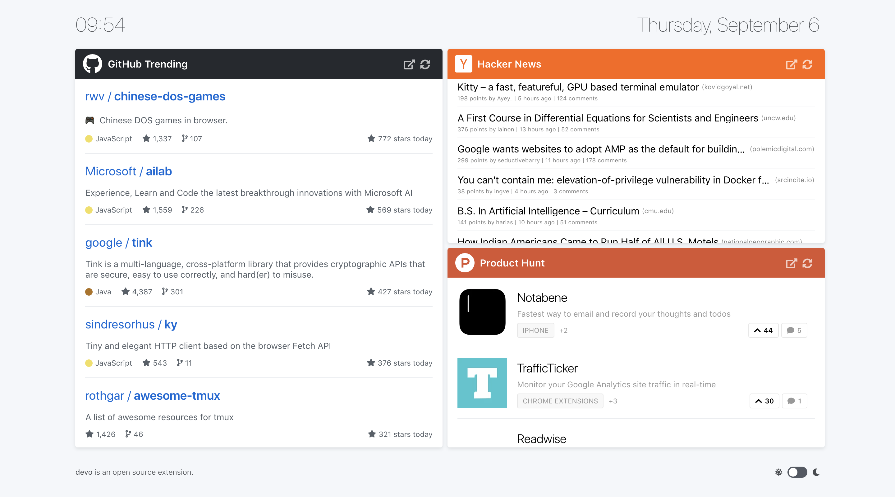
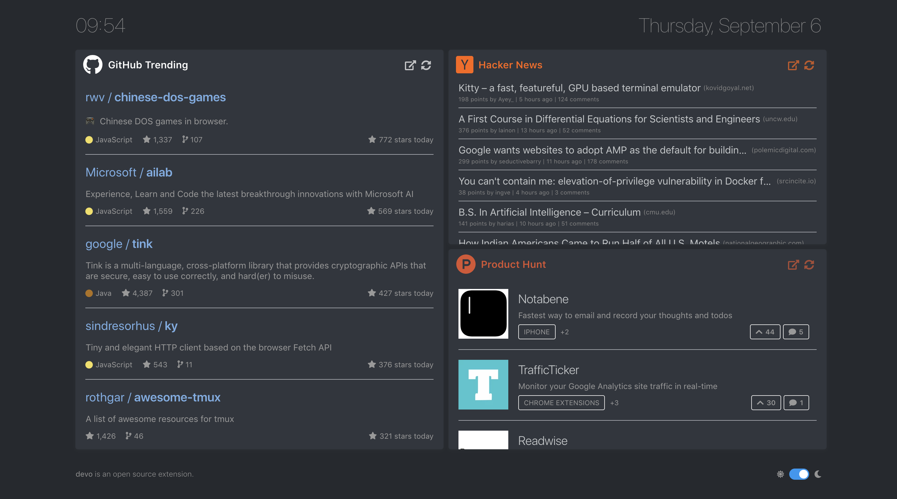

<p align="center">
  
</p>
<p align="center">
  GitHub Trending, Hacker News and Product Hunt, on every new tab!
</p>

---

__Devo__ is a Google Chrome and Mozilla Firefox extension that displays GitHub Trending, Hacker News, Product Hunt and more platforms on every new tab. It caches the information for 30 minutes, so that there is no extra calls to the external services, hence allowing a faster experience.

<a href="https://www.buymeacoffee.com/Mw3KB7oHE" target="_blank"></a>

<p align="center">
  
</p>

<p align="center">
  
</p>

## Installation
Devo can be installed for [Chrome here](https://chrome.google.com/webstore/detail/devo/elkhalpmbmbaeoemecpcfdcoekmpgmdm), and [Firefox here](https://addons.mozilla.org/en-US/firefox/addon/devo-new-tab/).

For installation on Safari:
1. [](https://app.netlify.com/start/deploy?repository=https://github.com/karakanb/devo)
2. Once deployed, [update homepage on safari](https://support.apple.com/guide/safari/change-your-homepage-ibrw1020/mac).

## Demo
[Demo can be found here.](https://burakkarakan.com/devo/)

## Platforms
Devo currently supports:
- [GitHub Trending](https://github.com/trending)
- [Hacker News](https://news.ycombinator.com/)
- [Product Hunt](https://www.producthunt.com/)
- [Designer News](https://www.designernews.co/)
- [DEV Community](https://dev.to/)
- [Lobsters](https://lobste.rs/)
- [TabNews](https://www.tabnews.com.br/)

### Adding a new platform
Adding a new platform is super easy. All you need to do is:
- add a body component that will be displayed in the cards.
- export the body component from the [`src/components/bodies.js`](./src/components/bodies.js) file.
- add the details for the platform to the [`src/settings.js`](./src/settings.js) file.
- add the state to the [`src/store.js`](.src/store.js) file.

You can check the [HackerNews component](./src/components/HackerNews/Body.vue) to see how easy it is to add a new platform. Feel free to submit pull requests or ask questions regarding adding a new platform, any kind of input is appreciated.

## How to build?

First of all, you need to install the dependencies. After that, you can run the build command and the optimized bundle will be created in `dist/` directory:
```sh
npm install # install the dependencies.
npm run build # build the optimized bundle.
```
